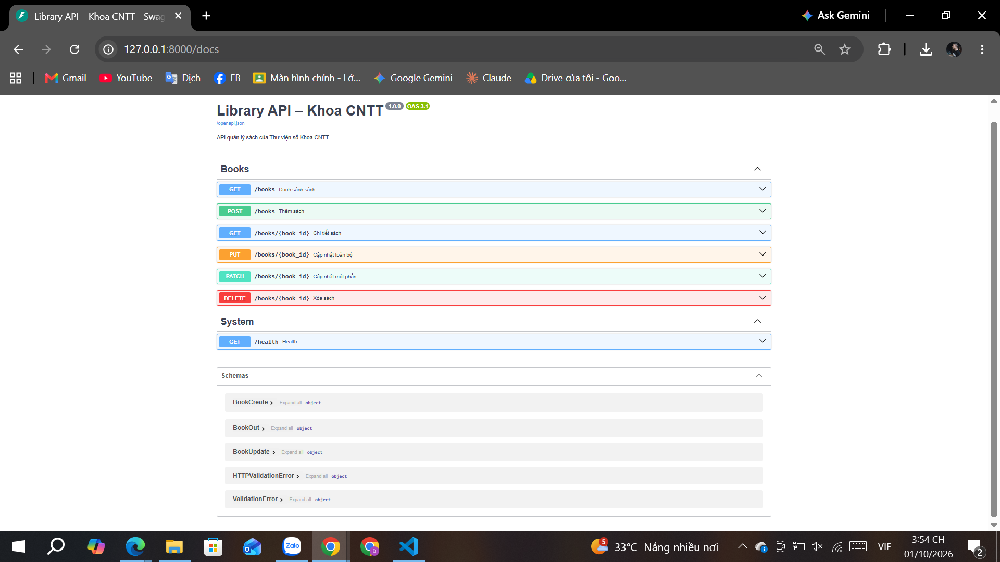
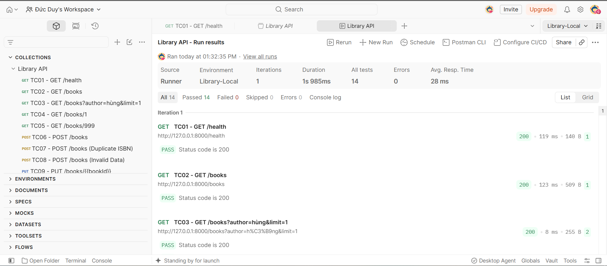

# Library API – Thư viện số Khoa CNTT

Bài thực hành số 4, học phần Lập trình mã nguồn mở: xây dựng Web API CRUD bằng FastAPI và kiểm thử bằng Postman.

Sinh viên: Nguyễn Đức Duy – Lớp CT2802

## 1. Case study

Thư viện Khoa CNTT đang quản lý sách bằng tệp Excel, mỗi lần tra cứu thủ thư phải mở tệp và tìm thủ công. Dự án này xây dựng một Library API để website thư viện và ứng dụng di động của sinh viên cùng gọi vào lấy dữ liệu.

API đáp ứng các yêu cầu nghiệp vụ:

- Xem danh sách sách, tìm theo tên sách hoặc tác giả, có phân trang.
- Xem chi tiết một cuốn sách theo mã (id).
- Thêm sách mới; mỗi ISBN là duy nhất, không được trùng.
- Cập nhật toàn bộ thông tin hoặc chỉ sửa một phần.
- Xóa sách khỏi hệ thống.

Dữ liệu được lưu trong bộ nhớ (danh sách Python) nên sẽ trở về dữ liệu mẫu mỗi khi khởi động lại server.

### Tài nguyên Book

| Trường | Kiểu | Ràng buộc | Ví dụ |
|---|---|---|---|
| id | int | Hệ thống tự sinh, tăng dần | 1 |
| isbn | str | Đúng 13 chữ số, duy nhất | 9786040000011 |
| title | str | 1–200 ký tự, bắt buộc | Lập trình Python cơ bản |
| author | str | 1–100 ký tự, bắt buộc | Nguyễn Văn Hùng |
| year | int | Từ 1900 đến 2100 | 2022 |
| quantity | int | ≥ 0, mặc định 1 | 5 |

## 2. Cài đặt và chạy

Yêu cầu: Ubuntu/WSL2, Python 3.10 trở lên, Git.

```bash
git clone <địa chỉ kho mã>
cd library-api
python3 -m venv .venv
source .venv/bin/activate
pip install -r requirements.txt
uvicorn app.main:app --reload
```

Sau khi chạy:

- API: http://127.0.0.1:8000
- Tài liệu Swagger UI: http://127.0.0.1:8000/docs

Lưu ý: chạy `uvicorn` ở thư mục gốc `library-api/`, không chạy bên trong `app/`.

## 3. Danh sách endpoint

| Phương thức | Endpoint | Chức năng | Thành công | Lỗi |
|---|---|---|---|---|
| GET | /health | Kiểm tra server đang chạy | 200 | |
| GET | /books | Danh sách; lọc `?q=`, `?author=`; phân trang `?skip=`, `?limit=` | 200 | 422 |
| GET | /books/{id} | Chi tiết một cuốn sách | 200 | 404 |
| POST | /books | Thêm sách mới | 201 | 409, 422 |
| PUT | /books/{id} | Cập nhật toàn bộ | 200 | 404, 409, 422 |
| PATCH | /books/{id} | Cập nhật một phần | 200 | 404, 422 |
| DELETE | /books/{id} | Xóa sách | 204 | 404 |

Ý nghĩa mã lỗi: 404 là không tìm thấy sách, 409 là ISBN đã tồn tại, 422 là dữ liệu gửi lên không hợp lệ.



## 4. Kiểm thử

Thư mục `postman/` chứa:

- `Library-API.postman_collection.json`: 12 test case (TC01–TC12), mỗi request có script kiểm tra tự động.
- `Library-Local.postman_environment.json`: biến `baseUrl = http://localhost:8000`.

| Mã | Request | Ý nghĩa | Mong đợi |
|---|---|---|---|
| TC01 | GET /health | Server đang chạy | 200 |
| TC02 | GET /books | Danh sách mặc định | 200 |
| TC03 | GET /books?author=hùng&limit=1 | Lọc tác giả, phân trang | 200, 1 bản ghi |
| TC04 | GET /books/1 | Sách tồn tại | 200 |
| TC05 | GET /books/999 | Sách không tồn tại | 404 |
| TC06 | POST /books | Dữ liệu hợp lệ; lưu id vào `bookId` | 201 |
| TC07 | POST /books | Gửi lại đúng ISBN của TC06 | 409 |
| TC08 | POST /books | isbn "123", year 1800 | 422 |
| TC09 | PUT /books/{{bookId}} | Gửi đủ các trường, đổi title | 200 |
| TC10 | PATCH /books/{{bookId}} | `{"quantity": 10}` | 200 |
| TC11 | DELETE /books/{{bookId}} | Xóa sách vừa tạo | 204 |
| TC12 | GET /books/{{bookId}} | Kiểm tra sau khi xóa | 404 |

### Chạy bằng Postman

1. Import hai tệp trong thư mục `postman/` vào Postman.
2. Chọn environment `Library-Local` ở góc trên bên phải.
3. Mở collection `Library API`, chọn Run, giữ đúng thứ tự TC01–TC12, bấm Start run.

### Chạy bằng dòng lệnh (Newman)

```bash
npx newman run postman/Library-API.postman_collection.json \
  -e postman/Library-Local.postman_environment.json
```

Vì dữ liệu lưu trong bộ nhớ, nên khởi động lại server trước mỗi lần chạy để TC07 (ISBN trùng) cho kết quả ổn định.

### Kết quả

Collection Runner chạy 12 request với 14 kiểm tra, tất cả đều Passed.



## 5. Cấu trúc thư mục

```
library-api/
├── app/
│   ├── __init__.py
│   ├── main.py          # Khởi tạo ứng dụng, endpoint /health
│   ├── models.py        # Pydantic model: BookCreate, BookUpdate, BookOut
│   ├── data.py          # Dữ liệu mẫu lưu trong bộ nhớ
│   └── routers/
│       ├── __init__.py
│       └── books.py     # 6 endpoint CRUD
├── postman/             # Collection và environment
├── docs/                # Ảnh minh chứng
├── requirements.txt
├── .gitignore
└── README.md
```
